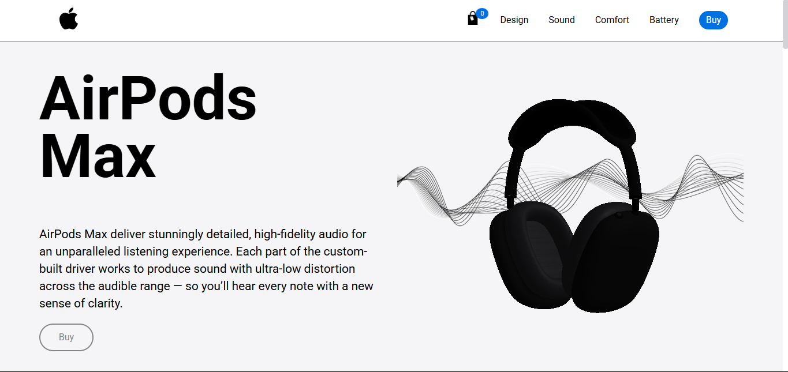

# AirPodsMax Website

This is a responsive e-commerce website showcasing and selling AirPods Max, featuring a 3D model viewer and an optimized user experience across devices. The project was created as part of my academic coursework to demonstrate **front-end development**, **API integration**, and **backend communication via serverless functions**.

---

## Features

- **Responsive Design**: Fully responsive pages, including a checkout flow optimized for mobile and desktop.  
- **3D Model Viewer**: Interactive 3D model of the AirPods Max built with Three.js, allowing users to explore the product dynamically.  
- **Checkout Process**: Shopping cart and checkout steps with dynamic validation and API communication.  
- **Tooltips**: Contextual tooltips for better user guidance (e.g., CVV input field).  
- **SEO Optimization**: Includes `sitemap.xml`, `robots.txt`, and meta descriptions for search engines.  
- **Accessibility**: Designed for easy navigation and usability across devices.   

---

## Backend Features

This project uses **Vercel Serverless Functions** as the backend, located in the `/api` folder.

- **Geolocation API (OpenCage)**: Retrieves location details based on the ZIP code entered by the user.  
- **Credit Card API (Binlist.net)**: Detects credit card brand during input and returns the corresponding card flag dynamically.  
- **Security & Error Handling**: Includes proper error handling for API responses, invalid queries, and rate limits.  

---

## Technologies Used

- **Frontend**: HTML, CSS, Vanilla JavaScript  
- **Backend**: Vercel Serverless Functions (Node.js runtime) - `/api` folder. No need for dedicated server
- **3D Rendering**: Three.js (via minified file)
- **Animations**: AOS.js (via CDN)
- **SEO**: Sitemap, robots.txt, and meta descriptions  
- **Deployment**: Vercel  
- **Version Control**: Git + GitHub  

---

## Running Locally

You can run both the frontend and the backend functions locally.

### Requirements
- [Node.js](https://nodejs.org/) installed  
- [Vercel CLI](https://vercel.com/download) installed globally (`npm i -g vercel`)  

---

### Steps
1. Clone the repository:
   - `git clone https://github.com/jpedromergulhao/airpodsmax.git`
2. Create a `.env` file in the root and place it:
   - `OPEN_CAGE_API_KEY=Your_Api_Key;`
3. Run the project locally: 
   - `vercel login` (If you are not authenticated to your vercel account)
   - `vercel dev`
4. The app will be available at:
   - Frontend: http://localhost:3000
   - Backend endpoints:
      - http://localhost:3000/api/geocode?zipCode=12345
      - http://localhost:3000/api/cardLookup?cardNumber=4111111111111111

You can use `4111111111111111` as a test card number. This is a fictitious Visa card provided for testing purposes only.

Note: Running `vercel login` is only for local simulation and will NOT link the project to your Vercel account or deploy it.

---

## Deployment
The website and backend functions are deployed on Vercel.
- Frontend and API routes share the same domain.
- Example API call in production: https://airpodsmax-five.vercel.app/api/geocode?zipCode=12345

---

### Files Overview
- `/api/geocode.js`: Handles API requests to fetch geolocation data from OpenCage. Validates input, structures responses, and manages errors.
- `/api/cardLookup.js`: Handles API requests to detect credit card brand via Binlist and returns relevant details.
- `sitemap.xml`: Provides search engines with a structured map of the site for better crawling.
- `robots.txt`: Controls how search engines crawl and index the site. Example:
- Tooltip: Guides users when filling in sensitive inputs like the CVV field.
- 3D Model (Three.js): Interactive 3D visualization of AirPods Max, improving user experience.

---

### SEO & Crawling Optimization
- Sitemap: Informs search engines of the site structure.
- Robots.txt: Restricts or allows crawling of specific pages.

---

## License
This project is academic and intended solely for demonstrating my development skills.
It is not open for contributions or forks.